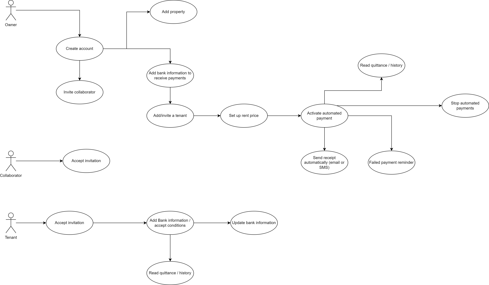
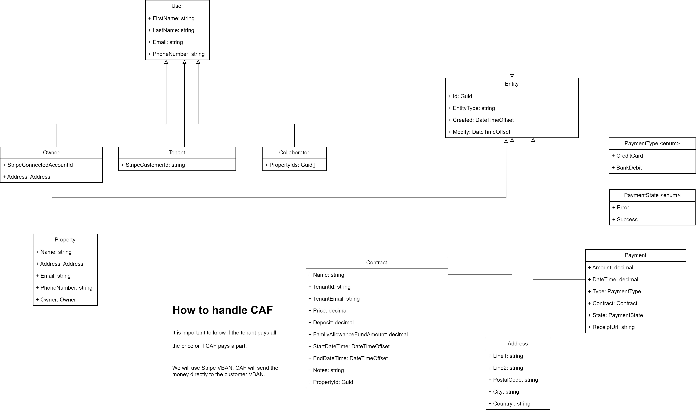
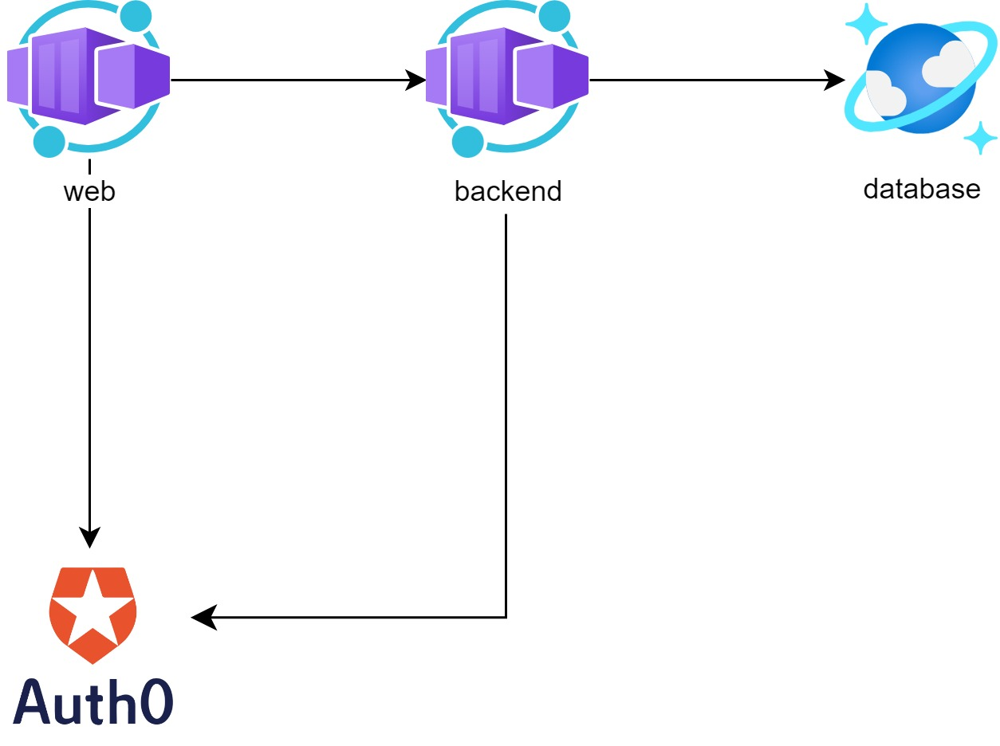

<!-- # 02 - Architecture de RentCRL -->

## 1 - Introduction

<head>
  <meta name="og:title" content="Architecture RentCRL"/>
  <meta name="og:image" content="/static/img/architecture-Infrastructure.png"/>
  <meta name="twitter:image" content="/static/img/architecture-Infrastructure.png"/>
</head>

Dans cet article, je vais vous présenter l'architecture de RentCRL, visant à simplifier la gestion locative en automatisant les tâches telles que la collecte des loyers et la génération des quittances pour les propriétaires.

## 2 - Choix Conceptuels

Pour ce projet de taille modeste, j'ai choisi de réaliser uniquement 3 diagrammes dans ma partie conception pour m'aider à le concrétiser.

<!-- truncate -->

Les voici :

### Diagramme de cas d'utilisation

<!--  -->

Le diagramme de cas d'utilisation de RentCRL illustre les interactions entre les utilisateurs et le système. Les acteurs, tels que les propriétaires, les locataires et les collaborateurs, interagissent avec différentes fonctionnalités de l'application.

### Diagramme de classe

<!--  -->

Le diagramme de classe de RentCRL modélise la structure des entités principales et leurs relations.

### Diagramme d'infrastructure

<!--  -->

L'infrastructure de RentCRL se compose de quatre éléments clés :

- Web : L'application web contenant les fichiers JavaScript, HTML, CSS.
- Backend : L'application backend renfermant les fichiers C# / .Net et responsable du fonctionnement logique du système.
- DataBase 'CosmosDB' : Le stockage sécurisé des données nécessaires au bon fonctionnement de RentCRL.
- Auth0 : L'authentification et la gestion des mots de passe des utilisateurs.

J'ai choisi ces trois diagrammes spécifiques pour leur pertinence même dans le cadre d'un projet modeste comme RentCRL. Ensemble, ils fournissent une perspective exhaustive des interactions utilisateur, de la structure des données et de l'infrastructure technique nécessaires pour le développement du système.

## 3 - CONCLUSION

Ces diagrammes constituent une base pour m'aider à la réalisation concrète de RentCRL. Dans le prochain article, je commencerai à montrer comment créer la solution.
