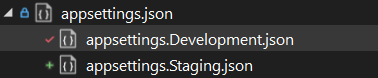
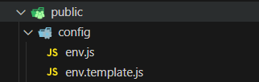
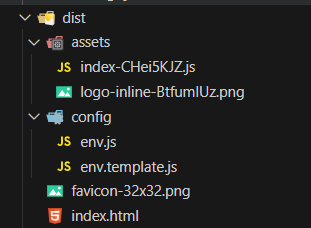

# Déployer une application React + ASP.NET Core + Cosmos DB sur Azure : gestion des environnements et des secrets

Dans cet article, je partage mon expérience de déploiement de RentCRL sur Azure. Cette application comprend :

- une application React

- une API REST construite avec ASP.NET Core

- une base de données Azure Cosmos DB

Mon objectif principal est de montrer comment je suis passé de l’environnement local "Development" à l’environnement "Staging" et de rendre RentCRL accessible à tout le monde..

## 1. Développement en local

### 1.1. Communication avec l’API

En local, il est facile de connecter le tout. Le frontend appelle l’API via un `fetch` avec le token d'Auth0 sur le bon endpoint. Dans mon cas, l’API permet juste de créer un owner, alors je me rends sur `apiBaseUrl/owners`, où `apiBaseUrl` équivaut à `http://localhost:5047` pour le moment. Au départ, j’enregistre la variable dans un fichier `.env`, ce qui donne :

```tsx
const token = await getAccessTokenSilently();
await fetch(`${import.meta.env.VITE_API_BASE_URL}/owners`, {
  method: "POST",
  headers: {
    "Content-Type": "application/json",
    Authorization: `Bearer ${token}`,
  },
  body: JSON.stringify({ ...owner }),
});
```

### 1.2. Communication entre l’application et la base de données

Ensuite, l’API récupère les informations puis crée le owner dans la base de données.

Cependant, l’API a besoin d’accepter les politiques de CORS provenant de l’application et de se connecter à la base de données pour effectuer les actions. Je configure cela dans le fichier `Program.cs`.

Voici le code pour accepter les politiques de CORS :

```csharp
builder.Services.AddCors(options =>
{
    options.AddPolicy(name: MyAllowSpecificOrigins,
                      policy =>
                      {
                          policy.WithOrigins(builder.Configuration["AppBaseUrl"])
                          .AllowAnyHeader()
                          .AllowAnyMethod()
                          .AllowCredentials();
                      });
});
```

Et voici le code pour se connecter à la base de données :

```csharp
 public static void AddDatabaseConnection(WebApplicationBuilder builder, IServiceCollection services)
 {
     var endpoint = builder.Configuration["CosmosDB:EndpointUri"];
     var primaryKey = builder.Configuration["CosmosDB:PrimaryKey"];
     var database = builder.Configuration["CosmosDB:DatabaseName"];
     services.AddSingleton(new CosmosDbService(endpoint, primaryKey, database));
 }
```

L’API a besoin de paramètres de configuration : le base URL de l’application, l’endpoint de la base de données, la clé primaire et le nom de la base de données.

Dans le fichier `appsettings.json`, je peux ajouter le base URL de l’application.

Pour la base de données, en lançant l’émulateur de Cosmos DB, je peux récupérer les informations nécessaires et les mettre directement dans le fichier `appsettings.json` :

```csharp
{
  "CosmosDB": {
    "EndpointUri": "https://localhost:8081",
    "PrimaryKey": "C2y6yDjf5/R+ob0N8A7Cgv30VRDJIWEHLM+4QDU5DE2nQ9nDuVTqobD4b8mGGyPMbIZnqyMsEcaGQy67XIw/Jw==",
    "DatabaseName": "RentCRLDatabase"
  },

  "AppBaseUrl": "http://localhost:5173"
}
```

C’est bon, tout est maintenant connecté : l’application peut envoyer une requête à l’API pour créer un owner, l’API peut l’accepter puis se connecter à la base de données et créer le owner.

Maintenant, comment faire pour que la configuration fonctionne également dans le monde réel et comment le faire proprement ?

Voyons comment j’ai procédé.

En local, l’environnement est celui de "Development" : tout tourne sur ma machine. Or, je veux aller en production ou, du moins pour le moment, en "Staging" (pré-prod). C’est-à-dire que je veux rendre l’application accessible à tous, et pour cela, j’ai choisi d’utiliser une solution serverless proposée par Azure : les Container Apps. Ainsi, les trois entités (application, API et Cosmos DB) ne tourneront plus sur ma machine, donc l’environnement change, tout comme les variables de configuration que j’ai mentionnées plus tôt. Voici comment j’ai adapté mes variables en fonction de l’environnement.

## 2. Préparation d’Azure

D’abord, je me suis rendu sur Azure et j’ai créé une base de données Cosmos DB : [https://learn.microsoft.com/en-us/azure/cosmos-db/nosql/quickstart-portal](https://learn.microsoft.com/en-us/azure/cosmos-db/nosql/quickstart-portal)

Ensuite, j’ai créé deux Container Apps : un pour faire tourner l’image de mon API et l’autre pour faire tourner l’image de mon application : [https://learn.microsoft.com/en-us/azure/container-apps/quickstart-portal](https://learn.microsoft.com/en-us/azure/container-apps/quickstart-portal)

Puis, j’ai créé un Container Registry pour pousser les images de mon application et de mon API, qui seront récupérées par les Container Apps : [https://learn.microsoft.com/en-us/azure/container-registry/container-registry-get-started-portal?tabs=azure-cli](https://learn.microsoft.com/en-us/azure/container-registry/container-registry-get-started-portal?tabs=azure-cli)

## 3. Déploiement de l’API sur Azure

ASP.NET gère les variables d’environnement automatiquement lors du lancement de l’application. Comme je l’ai montré plus tôt, grâce au fichier `appsettings.json`, je peux accéder aux variables de configuration. Maintenant, il suffit de séparer les variables qui changent en fonction de l’environnement dans les `appsettings` correspondants.

Je peux donc créer les fichiers `appsettings.Development.json` et `appsettings.Staging.json`.



Je déplace alors le code dans `appsettings.Development.json` :

```csharp
 "CosmosDB": {
   "EndpointUri": "https://localhost:8081",
   "PrimaryKey": "C2y6yDjf5/R+ob0N8A7Cgv30VRDJIWEHLM+4QDU5DE2nQ9nDuVTqobD4b8mGGyPMbIZnqyMsEcaGQy67XIw/Jw==",
   "DatabaseName": "RentCRLDatabase"
 },

 "AppBaseUrl": "http://localhost:5173"
```

Puis, dans `appsettings.Staging.json`, j’ajoute :

```csharp
{
  "CosmosDB": {
    "EndpointUri": "le endpoint uri de ta bd",
    "DatabaseName": "RentCRLDatabase"
  },

  "AppBaseUrl": "le base url du container app qui tourne sur l'image de ton app (frontend)"
}
```

Dans le `appsettings.Staging.json`, je ne mets pas la clé primaire car elle est secrète. J’utilise le Key Vault d’Azure qui me permet de gérer mes secrets, car ceux-ci ne doivent pas être exposés : [https://learn.microsoft.com/en-us/azure/container-apps/manage-secrets?tabs=azure-portal](https://learn.microsoft.com/en-us/azure/container-apps/manage-secrets?tabs=azure-portal)

Maintenant, grâce à la variable `ASPNETCORE_ENVIRONMENT`, si la valeur est "Development", alors `builder.Configuration` ira lire dans le fichier `appsettings.json` puis `appsettings.Development.json`, et si la valeur est "Staging", alors il ira lire dans le `appsettings.json` puis `appsettings.Staging.json`.

Après avoir créé le Dockerfile et buildé l’image de l’API, au moment de lancer l’image, je passe en paramètre la valeur de la variable d’environnement. Par défaut, dans une image Docker, c’est "Production".

```powershell
docker run -p 8080:80 -e ASPNETCORE_ENVIRONMENT=Staging test
```

Je vérifie que tout fonctionne sur ma machine. Si tout est ok, je pousse l’image dans le Container Registry d’Azure, puis je mets à jour l’image du Container App de l’API.

```powershell
az containerapp update `
    --name $containerAppName `
    --resource-group $resourceGroupName `
    --image $imageName `
    --cpu 0.5 `
    --memory 1.0Gi `
    --min-replicas 1 `
    --max-replicas 2 `
    --set-env-vars `
    ASPNETCORE_ENVIRONMENT=Staging `
    CosmosDB__PrimaryKey=secretref:cosmosdb-primary-key
```

Si tu as des erreurs de probes dans ton container app vérifie que ton api expose “/” comme endpoint.

```csharp
app.MapGet("/", () => Results.Ok("OK"));
```

Et que ton image écoute le port 80. Dans le dockerfile : **ENV ASPNETCORE_HTTP_PORTS=80.**

L’api fonctionne dans l’environnement de “Development” mais également en “Staging”. Disponible ici : [https://ca-rentcrl-api-stg-fc.politewater-4ee63bcd.francecentral.azurecontainerapps.io/scalar/v1#tag/rentcrlweb](https://ca-rentcrl-api-stg-fc.politewater-4ee63bcd.francecentral.azurecontainerapps.io/scalar/v1#tag/rentcrlweb)

## 4. Deploiement de l’app sur Azure

Pour l’app, j’utilise React, et contrairement à [ASP.NET](http://asp.net/), je n’ai pas trouvé de gestion des variables d’environnement aussi efficace dans React. C’est pourquoi Rémi Céraline ([https://www.remiceraline.com](https://www.remiceraline.com/)) m’a montré une approche plutôt intéressante que je vais partager ici.

Mon objectif est que les variables d’environnement puissent changer de valeur **après** le build de l’image, car je veux utiliser la **même image** dans l’environnement de développement, puis dans celui de staging pour les tests, et enfin en production. C’est bien la même image qui passe par ces trois environnements. Pour le moment, la seule variable qui change selon l’environnement est `apiBaseUrl`, et je veux pouvoir la modifier dans la commande `update`, comme pour l’API, avec cette commande :

```powershell
az containerapp update `
    --name $containerAppName `
    --resource-group $resourceGroupName `
    --image $imageName `
    --cpu 0.5 `
    --memory 1.0Gi `
    --min-replicas 1 `
    --max-replicas 2 `
    --set-env-vars `
    API_BASE_URL=https://ca-rentcrl-api-stg-fc.politewater-4ee63bcd.francecentral.azurecontainerapps.io
```

Maintenant dans mon application React, dans le dossier **public**, j’ai créé un dossier **config** dans lequel je cré un fichier env.js et env.template.js.

Dans mon application React, dans le dossier **public**, j’ai créé un dossier **config** dans lequel j’ai mis deux fichiers : `env.js` et `env.template.js`.



### env.js

```jsx
let globalConfig = {
  apiBaseUrl: "http://localhost:5047",
};
```

### env.template.js

```jsx
let globalConfig = {
  apiBaseUrl: "${API_BASE_URL}",
};
```

J’ai ensuite déclaré cette variable pour l’utiliser dans mon app React, qui fonctionne avec TypeScript. Dans le dossier **src**, j’ai ajouté un fichier **global.d.ts** dans lequel j’ai mis :

```tsx
declare var globalConfig: {
  apiBaseUrl: string;
};
```

Je remplace alors le code de tout à l’heure par :

```tsx
const token = await getAccessTokenSilently();
await fetch(`${globalConfig.apiBaseUrl}/owners`, {
  method: "POST",
  headers: {
    "Content-Type": "application/json",
    Authorization: `Bearer ${token}`,
  },
  body: JSON.stringify({ ...owner }),
});
```

### À quoi ça sert ?

Quand je build mon image, React crée un dossier **dist** qui contient le **bundler** avec tous les fichiers réunis dans un seul gros fichier.



À ce moment-là, il est trop tard pour changer la valeur des variables. Il aurait fallu avoir plusieurs fichiers de variables ou une logique conditionnelle pour choisir la bonne en fonction de l’environnement. À défaut, le fichier **global.d.ts** permet à TypeScript de comprendre l’objet `globalConfig` qui est déclaré dans le dossier **public** — donc **en dehors** du bundler — et qui se trouve dans le dossier **config** après le build.

C’est ce qui me permet de **réécrire sa valeur dans le Dockerfile** avant de lancer l’app grâce à la commande `envsubst`.

Voici la ligne qui permet de mettre à jour `env.template.js` :

```powershell
  API_BASE_URL=https://ca-rentcrl-api-stg-fc.politewater-4ee63bcd.francecentral.azurecontainerapps.io
```

Puis je remplace le contenu de `env.js` par celui de `env.template.js` avec la commande `envsubst` :

```powershell
CMD ["/bin/sh", "-c", "envsubst < /usr/share/nginx/html/config/env.template.js > /usr/share/nginx/html/config/env.js && nginx -g 'daemon off;'"]
```

Bien sûr il ne faut pas oublier d’importer la variable dans le **index.html** avant le **main.tsx**.

```html
<body>
  <script type="text/javascript" src="/config/env.js"></script>
  <div id="root"></div>

  <script>
    console.log(globalConfig);
  </script>

  <script type="module" src="/src/main.tsx"></script>
</body>
```

Avec tout ça, je peux mettre à jour le container app et spécifier l’environnement simplement.

## Conclusion

En suivant cette approche, j'ai pu :

**- Séparer les configurations** selon les environnements, ce qui facilite le déploiement et la maintenance.

**- Sécuriser les secrets** en utilisant Azure Key Vault.

**- Automatiser le déploiement** du frontend et du backend avec Azure Container Apps.

Code source : https://github.com/MickaelCRL/RentCRL

N'hésitez pas à me faire part de vos retours ou de vos questions !
